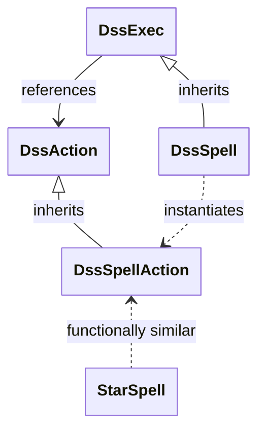
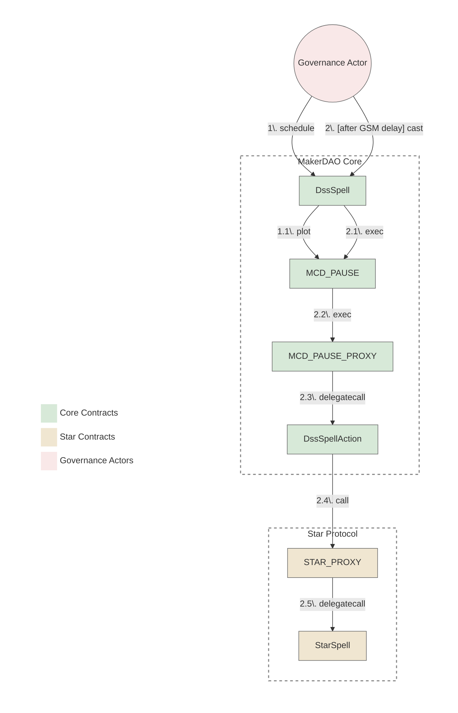

# Star Spells Reviewer Checklist

This checklist provides guidance for crafting and reviewing spells for Star protocols (Spark, Bloom, etc.). It focuses on common practices and should be used alongside protocol-specific knowledge.

## Governance Architecture Considerations

### Spells Contracts Relationships

The diagram below illustrates that, despite the name, `StarSpell` is functionally more similar to `DssSpellAction` than to `DssSpell`. Both `StarSpell` and `DssSpellAction` contain executable logic, whereas `DssSpell` primarily handles scheduling and execution triggering through `MCD_PAUSE`. This architectural similarity is important to understand when reviewing and developing spells for Star protocols.

<b>View Diagram</b>

### Execution Flow

The diagram bellow illustrates the execution flow of a spell from the Core up to the Star protocol.

<b>View Diagram</b>

## Star Spells Review Process

This section outlines the review process, divided into several stages from development to deployment.

### Development Stage

#### Preparation
- [ ] Check all commits made after the previous spell was merged to ensure no security-related changes are present.
- [ ] Verify solc version matches the Star protocol standard based on prior Star contracts.
- [ ] Verify spell instructions match the executive document.
- [ ] Core Spell office hours is `true` IF the Star Spell introduces a major change that can affect external parties, OTHERWISE explicitly set to `false`.

#### Spell Description & Comments
- [ ] Spell has a clear description.
- [ ] All significant actions and parameter changes are clearly commented.
- [ ] Every _Instruction text_ from the executive document is copied to the spell code as a comment.
- [ ] IF an instruction cannot be taken, it should have an explanation under the instruction prefixed with `// Note:`.
- [ ] IF an action in the spell doesn't have a relevant instruction, its necessity is explained in a comment prefixed with `// Note:`.
- [ ] All parameter changes are clearly commented with before/after values.

#### Contract Structure & Code Quality
- [ ] The only external non-view function in the spell contract is `execute()`.
- [ ] There are no methods that can modify contract state after deployment.
- [ ] No unused imports, interfaces, methods, or variables.
- [ ] All function visibility modifiers are explicitly declared.
- [ ] No redundant code or commented-out functionality.
- [ ] Addresses must be fetched from the relevant protocol's address registry (e.g., `spark-address-registry`, `bloom-address-registry`) IF they are present, OTHERWISE defined as `constant` when sourced from a trusted source (i.e., new contracts onboarding).
	
#### On-boarding New Contracts

- FOREACH new contract present in the spell:
  - [ ] Source code is verified on etherscan
  - [ ] Source code matches corresponding audited GitHub source code
    - [ ] IF source code is not audited, there is a clear explanation that was agreed upon by governance beforehand (i.e.: reusing unaudited contracts with lots of Lindy effect.)
  - [ ] Consistent compilation optimizations match deployment settings defined in the source code repo
  - [ ] Consistent license
  - [ ] Every constructor argument is validated
- FOREACH new contract that have the concept of `wards` or access control:
  - [ ] Ensure the Star `SubProxy` address was `relied` (`wards(STAR_PROXY)` is `1`)
  - [ ] Ensure that contract deployer address was `denied` (`wards(deployer)` is `0`)
  - [ ] Ensure that there are no other `Rely` events except for `STAR_PROXY` (using a block explorer like [etherscan](https://etherscan.io))
	
#### Interfaces
- [ ] No unused static interfaces.
- [ ] Declared static interface is not present in standard libraries, OTHERWISE should be imported from there.
- [ ] Interface matches the deployed contract.
- [ ] Each static interface declares only functions actually used in the spell code.

#### Variable Declarations
- [ ] All state variables are either `constant` or `immutable`.
- [ ] Precision units (`WAD`, `RAY`, `RAD`) match their standard defined values.
- [ ] Rates are calculated correctly and match their source (e.g., governance poll).
- [ ] Timestamps are commented with the full UTC date and convert correctly.

#### Deployment & Execution Security
- [ ] Spell is deployed using standard `CREATE` (not `CREATE2`).
- [ ] No `selfdestruct()` operations in the spell.
- [ ] No `delegatecall()` to untrusted contracts.
- [ ] No use of `tx.origin` for authorization.
- [ ] No external calls that could revert and fail the entire spell execution.
- [ ] No loops with unbounded gas consumption.
- [ ] No timestamp-dependent logic that could cause issues across the GSM delay.
- [ ] All math operations use safe math libraries or are checked for overflow/underflow.
- [ ] No unchecked return values from external calls.

#### Access Control
- [ ] Spell execution cannot be front-run by malicious actors.
- [ ] No privileged functions accessible by unauthorized users.
- [ ] For new contracts with access control (`wards`), ensure `PAUSE_PROXY` is `relied` and the deployer is `denied`.

#### Parameter Changes & Protocol Integration
- [ ] Star Protocol invariants are maintained after spell execution.
- [ ] All parameter changes use the appropriate helper functions IF available.
- [ ] Parameter changes match the executive document exactly.
- [ ] Spell interacts correctly with existing protocol components.
- [ ] Proper error handling for all external interactions.

#### Testing
- [ ] All actions are covered by tests.
- [ ] Integration tests verify the end-to-end execution flow.
- [ ] Gas tests ensure execution is possible within the existing block gas limit.
- [ ] Fork tests are used to simulate execution on a mainnet state.
- [ ] All tests are passing in CI.
- [ ] All tests are passing locally.

### Pre-Deployment Stage
- [ ] Final review of the executive document to ensure it matches the spell code.
- [ ] All actions present in the spell code are present in the final executive document.
- [ ] All actions in the final executive document are present in the spell code.
- [ ] If new commits were added after the initial review, the relevant checklist items have been re-verified.
- [ ] An explicit "Good to deploy" comment has been added to the PR by the required reviewers.

### Deployed Stage
- [ ] Deployed spell is verified on Etherscan.
- [ ] Deployed spell code matches the source on GitHub.
- [ ] Etherscan settings (optimizer, EVM version, license) are correct.
- [ ] A Tenderly simulation has been run and reviewed.
- [ ] The simulation shows all actions are executed successfully.
- [ ] The simulation shows no reverts or out-of-gas errors.

### Handover and Merge Stage
- [ ] All review comments have been addressed.
* [ ] Check that the spell address posted by the crafter in the appropriate channel is correct
* [ ] Confirm the address (via a separate "reply to" message, restating the address to avoid edits)
  * [ ] Wait until responsible governance facilitator confirms handover in `new-spells`
* [ ] Ensure that no changes were made to the code since the spell was deployed and archived
* [ ] Approve spell PR for merge via 'Approve' review option
