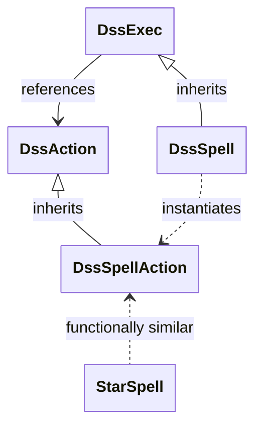
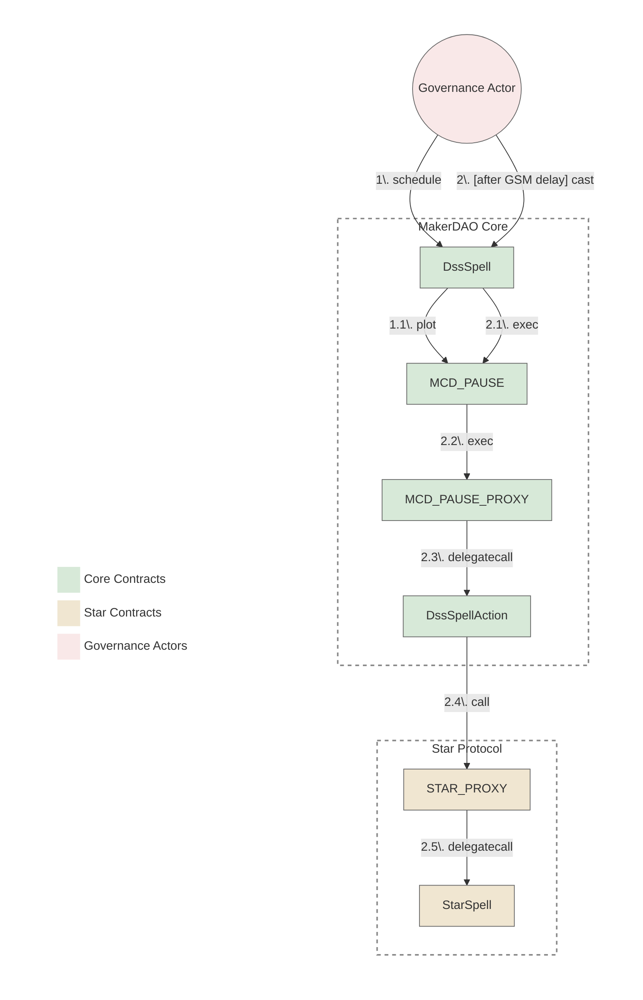

# Star Spells Reviewer Checklist

This checklist provides guidance for crafting and reviewing spells for Star protocols (Spark, Bloom, etc.). It focuses on common practices and should be used alongside protocol-specific knowledge.

## Governance Architecture Considerations

### Spells Contracts Relationships

The diagram below illustrates that, despite the name, `StarSpell` is functionally more similar to `DssSpellAction` than to `DssSpell`. Both `StarSpell` and `DssSpellAction` contain executable logic, whereas `DssSpell` primarily handles scheduling and execution triggering through `MCD_PAUSE`. This architectural similarity is important to understand when reviewing and developing spells for Star protocols.

<details>
<summary><b>View Diagram</b></summary>



</details>

### Execution Flow

The diagram bellow illustrates the execution flow of a spell from the Core up to the Star protocol.

<details>
<summary><b>View Diagram</b></summary>



</details>

## Star Spells Review Process

This section outlines the review process, divided into several stages from development to deployment.

### Development Stage

#### Preparation
- LIST all commits since the last externally reviewed spell.
  - `COMMIT_TITLE`, URL_TO_THE_PR_OR_THE_COMMIT
    - [ ] Content matches description: no unrelated changes.
    - [ ] No security-related changes are present in this commit.
- [ ] Verify solc version matches the Star protocol standard based on prior Star contracts.
- [ ] Verify forum posts proposing the changes follow [known template](https://docs.google.com/document/d/1vLqeP-zXmxKo2OpoxnL2z0ZczPe4nWN49-3URx-iKVA/edit?tab=t.nkz4n7by2dnh).
- [ ] Verify forum posts contains all new addresses, their constuctor arguments and rate limits used in the spell.
- [ ] Verify spell instructions match the forum posts with the proposals.
- [ ] IF the Star Spell introduces a major change that can affect external parties, suggest Governance Facilitators to set Core Spell office hours to `true`

#### Spell Description & Comments
- [ ] Spell has a clear description.
- [ ] All significant actions and parameter changes are clearly commented.
- [ ] Every _Instruction text_ from the executive document is copied to the spell code as a comment.
- [ ] IF an instruction cannot be taken, it should have an explanation under the instruction prefixed with `// Note:`.
- [ ] IF an action in the spell doesn't have a relevant instruction, its necessity is explained in a comment prefixed with `// Note:`.
- [ ] All parameter changes are clearly commented with before/after values.

#### Contract Structure & Code Quality
- [ ] The only external non-view function in the spell contract is `execute()`.
- [ ] There are no methods that can modify contract state after deployment.
- [ ] No unused imports, interfaces, methods, or variables.
- [ ] All function visibility modifiers are explicitly declared.
- [ ] No redundant code or commented-out functionality.
- [ ] Addresses must be fetched from the relevant protocol's address registry (e.g., `spark-address-registry`, `bloom-address-registry`) IF they are present, OTHERWISE defined as `constant` when sourced from a trusted source (i.e., new contracts onboarding).
- LIST all addresses used in the spell (defined as `constant` or fetched from the registry repo)
  - [CHAIN_NAME] `0xADDRESS`, EXTERNAL_SOURCE_URL
    - [ ] Matches valid external source (previously approved forum post, external docs, etc)

#### On-boarding New Contracts
- LIST every new contract present in the spell:
  - [CHAIN_NAME] `CONTRACT_NAME`, LINK_TO_THE_DEPLOYED_CONTRACT
    - [ ] Source code is verified on etherscan.
    - [ ] Source code matches corresponding audited GitHub source code.
      - [ ] IF source code is not audited, there is a clear explanation that was agreed upon by governance beforehand (i.e.: reusing unaudited contracts with lots of Lindy effect.)
    - [ ] Compilation optimizations match deployment settings defined in the source code repo.
    - [ ] Consistent license.
    - LIST every constructor argument:
      - `CONSTRUCTOR_ARGUMENT_NAME` being `CONSTRUCTOR_ARGUMENT_VALUE` from EXTERNAL_SOURCE_URL
        - [ ] The value has valid external source.
    - [ ] IF the contract have a concept of access control or `wards`:
      - [ ] Ensure correct admin address for this chain has full access (`SubProxy` on mainnet, `Executor` on other chains).
      - [ ] Ensure that contract deployer address has no access (e.g. `wards(deployer)` is `0`).
      - LIST any other addresses that has access to this contract:
        - `0xADDRESS_WITH_ACCESS` has `ROLE_NAME`, EXTERNAL_URL_WITH_REASONING
          - [ ] This address is expected to have access.

#### Dependency checks
- LIST every submodule or any other imported code used in this spell:
  - `DEPENDENCY_NAME` imported at commit `COMMIT_HASH` COMMIT_URL
    - [ ] Match audited commit for this dependency.
    - [ ] IF imported dependency doesn't match any auditted commit, LIST:
      - Imported `PATH_TO_IMPORTED_FILE` in `PATH_TO_THE_FILE_WHERE_IT_WAS_USED`, diff: GITHUB_COMPARE_URL
        - [ ] Applied changes looks safe, does not introduce malicious actions.
        - [ ] Applied changes does not introduce diff between imported and onchain interfaces.

#### Interfaces
- [ ] No unused static interfaces.
- [ ] Declared static interface is not present in standard libraries, OTHERWISE should be imported from there.
- [ ] Interface matches the deployed contract.
- [ ] Each static interface declares only functions actually used in the spell code.

#### Variable Declarations
- [ ] All contract variables declared as either `constant` or `immutable`.
- LIST all variables declaring or using precision (`WAD`, `RAY`, `RAD`, `e18`, `e6`, `e...`)
  - `VARIABLE_NAME` with precision `E_PRECISION_UNIT`, PREVIOUS_OCCASION_OR_PRECISION_SOURCE_URL
    - [ ] Precision match provided source url.
- [ ] Rates are expressed correctly (e.g. per `1 days`).
- [ ] Rates match their source (e.g., governance poll).
- [ ] Timestamps are commented with the full UTC date and convert correctly.

#### Deployment & Execution Security
- [ ] No `selfdestruct()` operations in the spell.
- [ ] No `delegatecall()` to untrusted contracts.
- [ ] No use of `tx.origin` for authorization.
- [ ] No external calls that could revert and fail the entire spell execution.
- [ ] No loops with unbounded gas consumption.
- [ ] No timestamp-dependent logic that could cause issues across the GSM delay.
- [ ] All math operations use safe math libraries or are checked for overflow/underflow.
- [ ] No unchecked return values from external calls.

#### Access Control
- [ ] Spell execution cannot be front-run by malicious actors.
- [ ] No privileged functions accessible by unauthorized users.
- [ ] For new contracts with access control (e.g. `wards`), ensure Star SubProxy is `relied` and the deployer is `denied`.

#### Parameter Changes & Protocol Integration
- [ ] Star Protocol invariants are maintained after spell execution.
- [ ] All parameter changes use the appropriate helper functions IF available.
- [ ] Parameter changes match the executive document exactly.
- [ ] Spell interacts correctly with existing protocol components.
- [ ] Proper error handling for all external interactions.

#### Testing
- LIST all tests and explain their coverage
  - `TEST_FUNCTION_NAME` ensures EXPLANATION_OF_WHAT_IT_ENSURES
    - [ ] The test is sufficient to ensure correctness and sufficientness of the high-level goal behind spell action
- [ ] All actions are covered by tests.
- [ ] Integration tests verify the end-to-end execution flow.
- [ ] Gas tests ensure execution is possible within the existing block gas limit.
- [ ] All tests are passing in CI at COMMIT_HASH.
- [ ] All tests are passing locally at COMMIT_HASH:

```
EXECUTED_TESTS_LOGS
```

### Pre-Deployment Stage
- [ ] Final executive document matches the spell code.
- [ ] All actions present in the spell code are present in the final executive document.
- [ ] All actions in the final executive document are present in the spell code.
- [ ] IF new commits were added after the initial review, the relevant checklist items have been re-verified.
- [ ] An explicit "Good to deploy" comment has been added to the PR by both reviewers.


### Deployed Stage

#### Deployed Contract
- [ ] Both reviewers gave explicit "good to deploy"
- [ ] A new comment in the PR contains link to the deployed spell(s) and Tenderly vnet(s)
- [ ] Deployed spell is verified on Etherscan.
- [ ] Deployed spell code matches local source code at the "good to deploy" commit.
- [ ] Etherscan settings (optimizer, EVM version, license) match local ones.
- [ ] Spell is deployed using standard `CREATE` (not `CREATE2`).
- [ ] Tests are executed against deployed spell.

```
EXECUTED_TESTS_LOGS
```

#### Simulation Checks
- [ ] The Tenderly simulation shows all actions are executed successfully.
- [ ] The Tenderly simulation shows no extra actions not present in the spell are executed.
- [ ] The Tenderly simulation shows no reverts or out-of-gas errors.
- [ ] An explicit "Good to handover" comment has been added to the PR by both reviewers.


### Handover and Merge Stage

#### Confirmed Handover
- [ ] All review comments have been addressed.
- [ ] The spell address posted by the crafter in the `#govops` thead matches evaluated above.
- [ ] Confirm the address (via a separate "reply to" message, restating the address to avoid edits)
- [ ] Ensure that no changes were made to the code since the spell was deployed and archived
- [ ] Approve spell PR for merge via 'Approve' review option
